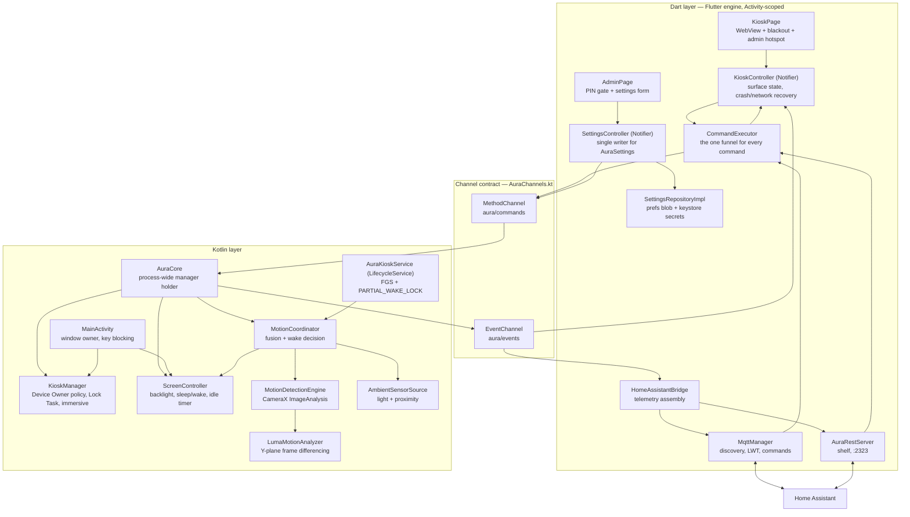
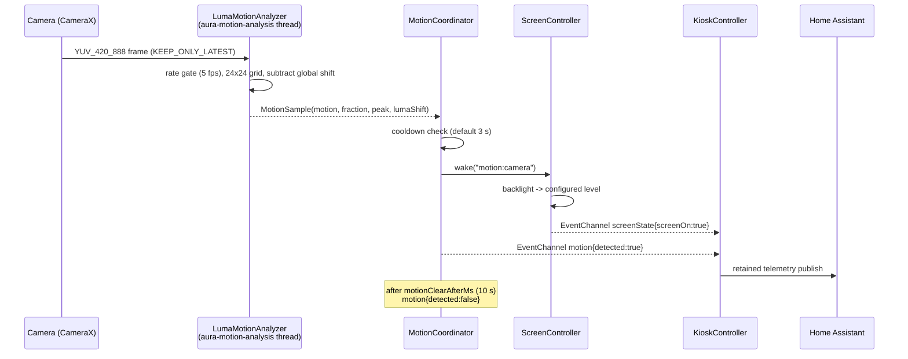

# Aura Display — Architecture

An open-source kiosk browser and device-management app for Android, built to turn
wall-mounted tablets into always-on, locked-down smart-home dashboards with
two-way Home Assistant control.

---

## 1. The one decision that shapes everything else

**Flutter cannot do kiosk.** Not partially — there is no Dart API for any of it:

| Requirement | Dart/Flutter API | Reality |
| --- | --- | --- |
| Lock Task / kiosk lockdown | none | `DevicePolicyManager` + `DeviceAdminReceiver` |
| Disable the status bar | none | `setStatusBarDisabled()`, Device Owner only |
| Keep display awake | none | `FLAG_KEEP_SCREEN_ON` on the Activity window |
| Turn the display off / set backlight | none | `lockNow()` / `WindowManager.LayoutParams.screenBrightness` |
| Camera frame analysis | `camera` plugin streams frames **into Dart** | copies every YUV plane over the platform channel |
| Foreground service types | none | `ServiceCompat.startForeground(..., types)` |

So Aura is a **thin Dart application layer over a substantial Kotlin platform
layer**, joined by one narrow, explicit channel contract. Roughly 60% of the
interesting code is Kotlin. Flutter earns its place on the other side of the
seam: the configuration UI, the settings model, the MQTT/REST clients and the
command semantics are all far pleasanter in Dart, and they are the parts that
change most often.

Two consequences to accept up front:

1. **The WebView is a platform view.** `flutter_inappwebview` composites an
   Android `WebView` into the Flutter surface (hybrid composition). That is one
   extra composition step versus a native Activity hosting the `WebView`
   directly. On any tablet from the last five years, a static dashboard does not
   notice. On a 2015 quad-core with 1 GB RAM, it does — measure before
   committing that hardware.
2. **The motion→wake decision is native, not Dart.** While the display is off,
   the Dart isolate may not be promptly scheduled. Routing
   `motion → EventChannel → Dart → MethodChannel → screen on` would add
   unbounded latency to the one interaction users judge a kiosk on. Native wakes
   the display, then *tells* Dart so it can publish to MQTT.

---

## 2. System design



### 2.1 Service layers

**WebView container** — `KioskPage` + `KioskController`. Owns the
`InAppWebViewController`, the crash-recovery path (`onRenderProcessGone` →
reload), the load-failure backoff, the connectivity-restore reload, the periodic
reload, and the `window.Aura` JS bridge. The controller *is* the `WebSurface`
that commands drive, resolved lazily so a WebView recreation never leaves remote
control pointing at a dead handle.

**Sensor / camera motion engine** — `MotionCoordinator` fuses two sources and
owns the wake decision. `MotionDetectionEngine` binds one CameraX
`ImageAnalysis` use case (no `Preview`) to the **service's** lifecycle so
analysis survives display-off. `LumaMotionAnalyzer` does the actual work:
downsample the Y plane to a 24×24 grid of block means, subtract the global luma
shift, threshold the local residual. `AmbientSensorSource` covers camera-less
units and OEMs that cut camera access when the panel sleeps.

**Local server / MQTT client** — `HomeAssistantBridge` assembles one
`DeviceTelemetry` document from kiosk state + battery + identity, and owns both
transports. `MqttManager` handles discovery, LWT, the HA birth-message replay
and command routing. `AuraRestServer` (shelf) serves the same surface over HTTP
for installs with no broker. Both funnel into the same `CommandExecutor`, so a
`screen_off` from an automation and one from a dashboard button are the same
code path.

**Device admin / kiosk manager** — `KioskManager` is the whole lockdown story in
one class, with three graceful degradation levels (§4). `ScreenController` owns
the display. `AuraKioskService` holds the foreground-service slot and the
`PARTIAL_WAKE_LOCK`.

### 2.2 Motion wake-up, end to end



The display is already lit before Dart is involved. That is the point.

---

## 3. Project structure

```
AuraDisplay/
├── pubspec.yaml
├── ARCHITECTURE.md
├── lib/
│   ├── main.dart                              # boot: resolve settings+identity, inject, runApp
│   ├── providers.dart                          # Riverpod wiring + SettingsController
│   ├── app/
│   │   └── aura_app.dart                       # MaterialApp, one route
│   ├── domain/                                 # pure Dart, no Flutter, no plugins
│   │   ├── models/
│   │   │   ├── aura_settings.dart               # full config + toNativeConfig()
│   │   │   ├── device_telemetry.dart            # the MQTT state document
│   │   │   └── remote_command.dart              # sealed command hierarchy
│   │   └── repositories/
│   │       └── settings_repository.dart         # persistence boundary
│   ├── data/
│   │   └── settings/
│   │       └── settings_repository_impl.dart    # prefs blob + keystore secrets
│   ├── platform/
│   │   ├── aura_platform.dart                   # the ONLY channel caller
│   │   └── device_identity.dart                 # nodeId, model, version, IP
│   ├── features/
│   │   ├── kiosk/
│   │   │   ├── kiosk_controller.dart            # Notifier<KioskState>, WebSurface
│   │   │   └── kiosk_page.dart                  # WebView + overlays + hotspot
│   │   └── admin/
│   │       └── admin_page.dart                  # PIN gate + settings + diagnostics
│   └── integration/
│       ├── command_executor.dart                # one funnel, exhaustive switch
│       ├── audio_announcer.dart                 # TTS + file playback
│       ├── home_assistant_bridge.dart           # telemetry assembly, transports
│       ├── mqtt/
│       │   ├── ha_discovery.dart                 # topics + discovery payloads
│       │   └── mqtt_manager.dart                 # connection, LWT, commands
│       └── rest/
│           └── aura_rest_server.dart             # shelf control API
└── android/app/src/main/
    ├── AndroidManifest.xml
    ├── res/xml/{device_admin,network_security_config,data_extraction_rules}.xml
    └── kotlin/com/auradisplay/kiosk/
        ├── MainActivity.kt                       # window owner, key blocking
        ├── AuraChannels.kt                       # the channel contract
        ├── AuraCore.kt                           # process-wide manager holder
        ├── AuraConfig.kt                         # native config slice
        ├── kiosk/
        │   ├── KioskManager.kt                    # ★ lockdown
        │   ├── AuraDeviceAdminReceiver.kt
        │   └── SystemBarBlocker.kt                # non-Device-Owner fallback
        ├── power/
        │   └── ScreenController.kt                # ★ display power
        ├── vision/
        │   ├── MotionDetectionEngine.kt           # ★ CameraX
        │   ├── LumaMotionAnalyzer.kt              # ★ frame differencing
        │   ├── AmbientSensorSource.kt
        │   └── MotionCoordinator.kt               # fusion + wake decision
        └── service/
            ├── AuraKioskService.kt                # ★ FGS + wake lock
            └── BootReceiver.kt
```

**Dependency rule**: `domain` imports nothing from the project.
`data`/`integration`/`features` may import `domain`. Nothing imports `features`
except `app`. The only file that touches a `MethodChannel` is
`platform/aura_platform.dart`.

**Why one Gradle module and not seven.** Package boundaries here are enforced by
review, not by the build graph, and that is the right trade for now: a Flutter
Android host is already a build-config-heavy place, and splitting `:vision`,
`:kiosk` and `:power` into modules would buy compile-time isolation this
codebase does not yet need. When it does — a second app flavour, or a
build-time regression — the extraction map is already the package layout above,
and only `AuraCore` and `AuraChannels` would need to move to a `:host` module.

---

## 4. Kiosk lockdown: three levels, honestly labelled

`KioskManager` degrades rather than fails, and reports which level is active
through `status()` (rendered in the admin diagnostics).

| Level | Setup | HOME | RECENTS | Status bar | Escapable? |
| --- | --- | --- | --- | --- | --- |
| **1. Immersive** | nothing | ✗ | ✗ | hidden, swipe reveals | yes, trivially |
| **2. Screen pinning** | nothing | blocked | blocked | hidden | yes — hold BACK+RECENTS |
| **3. Device Owner Lock Task** | `adb dpm set-device-owner` | dead | dead | disabled by policy | no |

**Level 3 is the only real lockdown.** Provision it — the device must have zero
accounts, so factory-reset first, skip account setup, then:

```bash
adb shell dpm set-device-owner \
  com.auradisplay.kiosk/.kiosk.AuraDeviceAdminReceiver
```

What Device Owner unlocks, all applied by `applyDeviceOwnerPolicies()`:

- `setLockTaskPackages` — Lock Task with no user confirmation dialog
- `setLockTaskFeatures(LOCK_TASK_FEATURE_NONE)` — no HOME, no RECENTS, no
  keyguard, no power menu (opt back in with `allowPowerMenu`)
- `setStatusBarDisabled(true)` — the reliable shade kill
- `setKeyguardDisabled(true)` — motion wake lands on the dashboard, not a lock screen
- `STAY_ON_WHILE_PLUGGED_IN` — keep-awake that survives our process dying
- `setPermissionGrantState(CAMERA, POST_NOTIFICATIONS)` — a wall unit has nobody
  to tap a permission dialog
- `addPersistentPreferredActivity(HOME)` — owning HOME neutralises the HOME key
  *and* gives free auto-start at boot
- `setUninstallBlocked` + `setUserControlDisabledPackages` — no uninstall, no
  force-stop, no clear-data

Without Device Owner, `SystemBarBlocker` parks a transparent
`TYPE_APPLICATION_OVERLAY` window over the status-bar strip that returns `true`
from `onTouch`. It stops a casual top-edge swipe. It does not stop every OEM
skin's two-finger shade pull, and it does nothing about the RECENTS gesture. It
is a mitigation, not a lock.

---

## 5. Power management

Two screen-off strategies, both implemented, operator-selectable:

| | `dim` (default) | `deviceLock` |
| --- | --- | --- |
| Mechanism | window backlight → 0 + Flutter black overlay | `DevicePolicyManager.lockNow()` |
| Panel | still on | genuinely off |
| Wake latency | instant | ~300–800 ms |
| Keyguard on wake | never | possible |
| Permissions | none | device admin (`force-lock`) |
| Power draw | LCD still leaks backlight | real saving |

`dim` is the correct default for a mains-powered wall dashboard: instant wake and
a warm WebView matter more than a few hundred milliwatts. `deviceLock` is for
battery-powered or bedroom installs.

Brightness is **window-scoped** (`WindowManager.LayoutParams.screenBrightness`)
rather than system-wide. It needs no permission, applies instantly, and only
affects our window — which in kiosk mode is the only thing on screen.
`useSystemBrightness` switches to `Settings.System.SCREEN_BRIGHTNESS` for
operators who want the change to outlive the app, at the cost of a
`WRITE_SETTINGS` grant that must be tapped through manually (a Device Owner
*cannot* grant it).

Keep-awake is layered: `FLAG_KEEP_SCREEN_ON` for the display,
`PARTIAL_WAKE_LOCK` in the service so MQTT and motion analysis survive Doze, and
`STAY_ON_WHILE_PLUGGED_IN` as the policy-level backstop.

---

## 6. Motion detection: why frame differencing and not ML

This runs 24/7 on a wall-powered tablet whose only job is to notice that a human
walked into the room.

The Y plane of a `YUV_420_888` buffer **is already a greyscale image** — no
colour conversion, no copy, no native library, no model warm-up. Downsampling
640×480 to a 24×24 grid of block means costs ~9 000 byte reads per frame; at
5 fps that is under 1% of one core. An OpenCV dependency would add ~10 MB to the
APK; a person-detection model adds that plus an inference budget, to answer a
question a subtraction already answers.

Three details make it work in practice rather than in theory:

1. **Subtract the global luma shift before thresholding.** Auto-exposure ramps
   the whole frame constantly, and switching on a room light moves every cell at
   once. Naive frame differencing fires non-stop on both. Removing the mean
   delta leaves only *local* change — something actually moved.
2. **Report the global shift separately.** A large uniform jump is not motion by
   the local test, but on a wall display it almost always means someone hit the
   light switch — which is exactly when the dashboard should wake. It is
   surfaced as its own trigger (`source: "illumination"`).
3. **Rate-limit in the analyzer, and ask the sensor to run slow.** The analyzer
   drops frames above `motionAnalysisFps`, and `Camera2Interop` sets
   `CONTROL_AE_TARGET_FPS_RANGE` to 5–15 so the ISP idles between frames instead
   of producing 30 fps we throw away.

One 0–100 sensitivity slider maps onto both thresholds
(`MotionTuning.fromSensitivity`): per-cell delta 28→4, changed-area fraction
0.18→0.008. That is all anybody wants to tune on a wall tablet.

**Privacy**: frames are never stored, never copied off the analysis thread, and
never exposed to Dart. Only aggregates (`changedFraction`, `peakDelta`,
`meanLuma`) leave the analyzer.

**Escalation path**, if presence is not enough: keep this engine as the cheap
always-on gate and only run a real detector on the frames it flags. A
LiteRT/MediaPipe person detector on ~1 fps of *pre-filtered* frames costs a
fraction of running it continuously.

---

## 7. Home Assistant integration

### 7.1 Topics

```
aura/<node>/state              retained JSON telemetry  (Aura → HA)
aura/<node>/availability       "online" / "offline"     (offline is the LWT)
aura/<node>/cmd/<entity>       per-entity commands      (HA → Aura)
aura/<node>/command            generic JSON envelope    (automations → Aura)
homeassistant/status           HA birth/will → replay discovery
```

**One state topic, many `value_template`s.** Every sensor reads the same retained
JSON document. That is one publish per update instead of a dozen, and after an
HA restart a single retained message repopulates every entity.

**Availability is the broker's job.** The LWT is registered at connect, so if the
tablet drops off the wifi the broker publishes `offline` for us and entities go
*unavailable* rather than showing a stale battery reading.

**Replay discovery on HA's birth message.** Without it, entities silently stop
working after an HA restart until Aura happens to reconnect.

### 7.2 Entities created by discovery

| Entity | Platform | Direction | Notes |
| --- | --- | --- | --- |
| Screen | `light` | ↔ | on/off **and** brightness 0–255, `on_command_type: first` |
| Motion | `binary_sensor` | → | `device_class: motion`, source in attributes |
| Motion detection | `switch` | ↔ | `entity_category: config` |
| Battery | `sensor` | → | `%`; `-1` suppressed for mains-only units |
| Charging | `binary_sensor` | → | `device_class: battery_charging` |
| Illuminance | `sensor` | → | `lx`, from the ambient light sensor |
| Current URL | `sensor` | → | full URL + title in attributes (state caps at 255) |
| Kiosk locked | `binary_sensor` | → | Lock Task diagnostics |
| Reload dashboard | `button` | ← | |
| Bring to foreground | `button` | ← | |
| Navigate to | `text` | ← | HA's 255-char limit; longer URLs → JSON envelope |
| Speak | `notify` | ← | TTS |

The screen is modelled as a `light` rather than a `switch` on purpose: it has
brightness, so a light gets the operator a real slider, transitions and
`light.turn_on` semantics for free.

### 7.3 Commands

Every command reaches the same `CommandExecutor` through one of three doors:
a per-entity MQTT topic, the JSON envelope, or `POST /api/command`.

```yaml
# JSON envelope — one topic for everything
- service: mqtt.publish
  data:
    topic: aura/<node>/command
    payload: >-
      {"command": "navigate_to", "url": "http://ha.local:8123/lovelace/kitchen"}
```

```yaml
# No broker? The local REST API is equivalent.
rest_command:
  hallway_screen_off:
    url: "http://192.168.1.40:2323/api/command"
    method: post
    headers:
      authorization: "Bearer <admin PIN>"
    content_type: "application/json"
    payload: '{"command": "screen_off"}'
```

Supported: `screen_on`, `screen_off`, `set_brightness`, `navigate_to`, `reload`,
`load_start_url`, `bring_to_foreground`, `play_audio` (TTS or file URL),
`set_motion_detection`, `eval_js`.

**Security posture, stated plainly.** The REST API listens on the LAN with
bearer-token auth and no TLS, and the token is the admin PIN. A default PIN of
`1234` means anyone on the wifi can drive the display. Set a real PIN, or
disable the REST server and use MQTT only.

### 7.4 Why MQTT lives in Dart, not in the service

A kiosk Activity never leaves the foreground, so the Dart isolate is always
scheduled and a Dart MQTT client is always alive. That buys a much nicer
implementation than a Kotlin one, at the cost of one real limitation: if the
Activity is destroyed, the HA link goes with it.

If that ever matters — a variant that runs headless, or an OEM ROM that kills
Activities aggressively — the move is to reimplement `MqttManager` in Kotlin
inside `AuraKioskService`, which already has the foreground slot and the wake
lock. The `DeviceTelemetry` document and topic layout are the contract; nothing
else has to change. A second Dart isolate via `flutter_foreground_task` is the
other option and is *not* recommended: two isolates plus IPC is more moving
parts than a Kotlin client.

---

## 8. Foreground service and the Android 12→15 minefield

The service declares `camera|specialUse`, and this is where kiosk apps usually
break:

- **`camera` type requires a visible Activity to start.** So the service is
  started from `MainActivity.onResume()`, never from a receiver.
- **`BOOT_COMPLETED` cannot start a camera-type FGS on Android 15+** — it throws
  `ForegroundServiceStartNotAllowedException`. `BootReceiver` therefore starts
  the *Activity*, which then starts the service. (And if Aura is the Home app,
  the system launches it at boot anyway; the receiver is a backstop.)
- **Type is computed at runtime.** With motion detection off, the service asks
  for `specialUse` only — asking for `camera` when no camera is used is both a
  policy problem and a needless start restriction.
- **`startForeground` is wrapped in a retry.** If the typed call is rejected, it
  falls back to `specialUse` alone and, failing that, gives up quietly rather
  than crashing a wall display at 3am.

`LifecycleService` (not plain `Service`) is the base class for one specific
reason: CameraX's `bindToLifecycle()` needs a real `Lifecycle`, and binding to
the *service* is what lets frame analysis continue while the display is off.

---

## 9. Channel contract

Two channels, one direction each, both defined in `AuraChannels.kt` and consumed
only by `aura_platform.dart`.

`aura/commands` (Dart → native): `getStatus`, `pushConfig`, `engageKiosk`,
`releaseKiosk`, `startLockTask`, `stopLockTask`, `applyDeviceOwnerPolicies`,
`clearDeviceOwnerPolicies`, `bringToForeground`, `setScreen`, `setBrightness`,
`noteInteraction`, `startService`, `stopService`, `openAdminActivation`,
`openOverlaySettings`, `openWriteSettings`, `openHomeAppSettings`.

`aura/events` (native → Dart): `ready` (full snapshot on first listen),
`motion`, `motionState`, `screenState`, `kioskStatus`.

**Config flows one way.** Dart owns `AuraSettings` and persistence; on every
change it pushes the native-relevant slice down via `pushConfig`
(`AuraSettings.toNativeConfig()` ↔ `AuraConfig.fromMap()`). Native caches it, so
the service behaves correctly even when Dart is not being scheduled. The key
names in those two functions are a contract — changing one without the other
fails silently, which is the single most likely bug in this codebase.

**When to switch to Pigeon**: once the surface stops changing. Hand-written
channels were chosen to keep the project buildable with zero codegen, and the
whole surface is 200 lines in two files. Pigeon would make the map keys
compile-checked on both sides; the migration touches only `AuraChannels.kt` and
`aura_platform.dart`.

---

## 10. Tech stack

| Concern | Choice | Why this and not the obvious alternative |
| --- | --- | --- |
| WebView | `flutter_inappwebview` 6.x | `webview_flutter` exposes none of the three APIs this app cannot live without: `onReceivedServerTrustAuthRequest` (SSL bypass), `onRenderProcessGone` (crash recovery), `addJavaScriptHandler` (JS bridge) |
| State | Riverpod 2.x `Notifier` | compile-safe DI + testable controllers, no codegen; `provider` has no equivalent of `ref.listen` for cross-controller reaction |
| Models | hand-written immutable classes | `freezed` is nicer but adds `build_runner` to every contributor's loop; 40 fields did not justify it |
| MQTT | `mqtt_client` 10.x | the mature Dart client, with `autoReconnect`, LWT and retained-publish support |
| Local server | `shelf` + `shelf_router` | pure Dart, no platform code, trivial middleware for auth |
| Settings | `shared_preferences` JSON blob | always read/written whole; a blob makes per-field forward-compat trivial |
| Secrets | `flutter_secure_storage` | MQTT password + admin PIN in the Android Keystore, never in the blob |
| Camera | CameraX 1.4 (Kotlin) | the `camera` plugin's Dart frame stream copies every plane over the channel; analysis stays native |
| Service | `LifecycleService` + `ServiceCompat` | CameraX needs a real `Lifecycle`; `ServiceCompat` handles the API 34 type argument |
| Motion | Y-plane frame differencing | see §6 |

Pinned toolchain: AGP 8.7.3, Kotlin 2.1.0, `minSdk` 26, `compileSdk`/`targetSdk`
from the Flutter SDK. Plugin versions in `pubspec.yaml` are a starting point —
run `flutter pub upgrade --major-versions` and let the Android Studio upgrade
assistant move AGP/Kotlin.

---

## 11. Implementation roadmap

Each milestone is independently demoable on a real tablet — which matters,
because most of what is hard here only fails on real hardware.

**M0 — Skeleton (½ day).** `flutter create` scaffold, the Gradle files,
`MainActivity` + `AuraChannels` + `AuraCore` with `getStatus` only. Demo: Dart
prints a native status map.

**M1 — Fullscreen WebView (1 day).** `KioskPage` with the curated
`InAppWebViewSettings`, `KioskController`, immersive mode via `KioskManager`,
`FLAG_KEEP_SCREEN_ON`. Demo: a dashboard fills the panel and stays lit.
*Verify:* transient-bar swipe re-hides (`onWindowFocusChanged`), rotation does
not reload.

**M2 — Settings + admin panel (1 day).** `AuraSettings`,
`SettingsRepositoryImpl`, `SettingsController`, the PIN gate, the four-tap
hotspot, `pushConfig`. Demo: change the start URL on-device and it survives a
reboot.

**M3 — Kiosk lockdown (1–2 days).** `AuraDeviceAdminReceiver`,
`applyDeviceOwnerPolicies`, Lock Task, key blocking, `SystemBarBlocker`. Demo:
factory-reset a tablet, provision Device Owner, watch HOME and the shade die.
*Verify:* all three levels report correctly in diagnostics; `Exit kiosk` works
(you will need it).

**M4 — Power management (1 day).** `ScreenController`, both screen-off modes,
the idle timer, the black overlay, `onUserInteraction` wiring. Demo: screen
sleeps on timeout, wakes on tap, brightness slider works.
*Verify:* measure the panel with a light meter in `dim` mode — some LCDs do not
go dark enough and need `deviceLock`.

**M5 — Motion engine (2 days).** `AuraKioskService`, `MotionDetectionEngine`,
`LumaMotionAnalyzer`, `AmbientSensorSource`, `MotionCoordinator`. Demo: walk
into the room, panel lights before you reach it.
*Verify:* leave it running overnight and check `changedFraction` in logcat — if
it fires on nothing, the global-shift compensation is doing its job; if it never
fires, drop `cellDeltaThreshold`. Check battery draw over 24h.

**M6 — Home Assistant (2 days).** `HaDiscovery`, `MqttManager`,
`HomeAssistantBridge`, `CommandExecutor`, `AuraRestServer`. Demo: the device
appears in HA with twelve entities; the brightness slider works both ways.
*Verify:* restart HA (entities must come back), kill the wifi (entities must go
*unavailable*, not stale), restart the broker.

**M7 — Hardening.** Boot receiver, OEM autostart whitelisting (Xiaomi/Huawei/
Oppo need per-vendor settings no manifest can substitute for), release signing,
ProGuard verification, a 7-day burn-in.

---

## 12. Known constraints

- **OEM battery managers** kill background apps regardless of foreground
  services. Xiaomi/Huawei/Oppo/Vivo each need their own "autostart" and
  "no battery restriction" toggles set by hand.
- **Camera while the display is off** works on most devices but not all — some
  OEMs revoke camera access when the panel sleeps. `MotionCoordinator` falls
  back to `AmbientSensorSource` when the camera fails to bind.
- **`WRITE_SETTINGS` cannot be auto-granted**, not even by a Device Owner. If
  `useSystemBrightness` is on, an operator must tap through it once.
- **Device Owner requires zero accounts**, so provisioning means a factory
  reset. Plan for it in deployment instructions.
- **HA entity states cap at 255 characters**, which is why the URL sensor
  truncates and puts the full value in an attribute.
- **`text` platform `max` is 255**, so `navigate_to` via that entity cannot take
  a longer URL. Use the JSON envelope.
